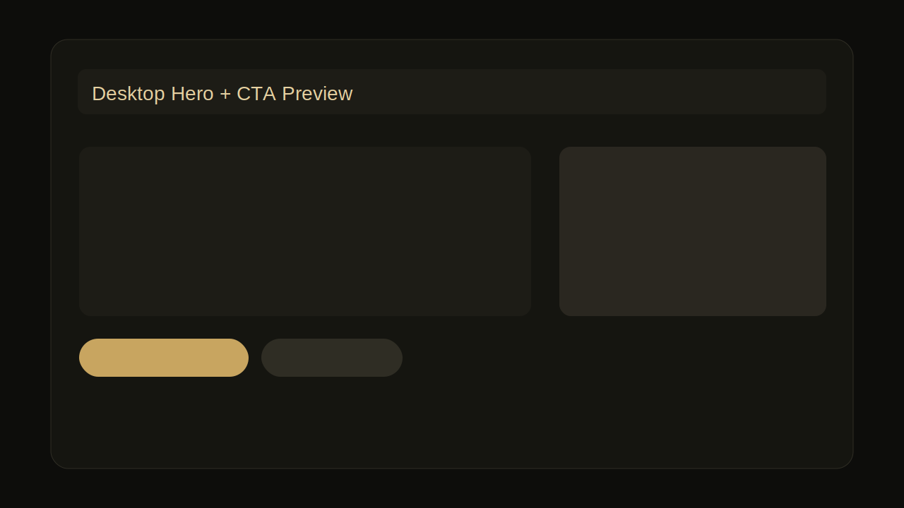
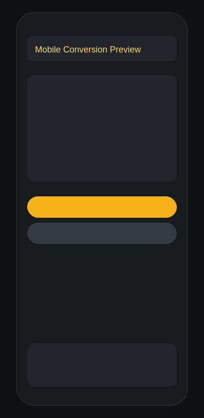
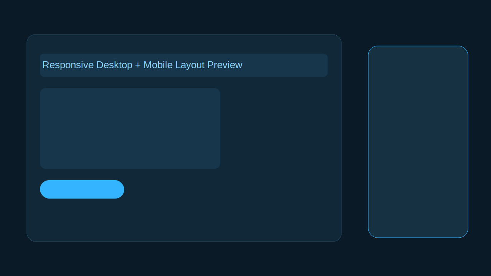
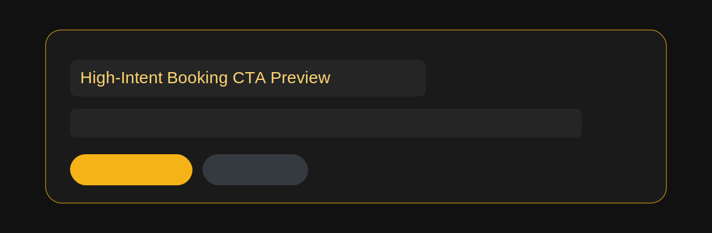

# AI Local Business Delivery Platform

A scalable AI-assisted frontend platform for delivering high-quality local business websites from a single reusable codebase.

This repository is designed to combine:

- Client-facing production quality
- Configuration-driven business switching
- Multi-project Vercel deployment from one repository
- Fast, repeatable delivery for international teams

## Live Demos

| Preset | Business Name | Category | URL |
|---|---|---|---|
| barber | The Garrison Grooming Co. | Barber Shop | https://garrisongrooming-demo.vercel.app/ |
| gym | Forge Elite Gym | Gym / Fitness | https://ironcoregym-demo.vercel.app/ |
| plumbing | RapidFlow Plumbing | Plumbing Service | https://rapidplumbing-demo.vercel.app/ |
| cleaning | Pristine Clean Services | Cleaning Service | https://pristineclean-demo.vercel.app/ |

## Visual Showcase

### Desktop Preview



### Mobile Preview



### Responsive Preview



### Hero Section Preview


### CTA Section Preview



## Project Overview

This platform is built for agencies and product teams that deliver many local business sites. Instead of rebuilding from scratch, it reuses a stable section system and configuration layer to scale delivery.

Core value:

- Lower implementation cost per client
- Consistent quality across projects
- Minimal component rewrites when adding new business types
- Standardized deployment workflow for operational efficiency

## Architecture Overview

- Next.js App Router for modern rendering and routing
- TypeScript for safe, maintainable business configuration
- TailwindCSS for reusable UI patterns
- Preset-driven content, SEO, and branding without layout rewrites

Main directories:

```bash
src/app
src/components
src/sections
src/constants
src/content
src/lib
public/images
public/portfolio
```

## Preset System

The active preset is selected by environment variable:

```dotenv
NEXT_PUBLIC_BUSINESS_PRESET=barber
```

Available presets:

- barber
- gym
- plumbing
- cleaning

Resolver behavior:

- Uses `src/lib/preset-resolver.ts`
- Falls back safely to `barber` if the value is invalid
- Switches business details, services, testimonials, SEO, and branding consistently

## Vercel Deployment Pattern

Create multiple Vercel projects from the same repository, each with a different preset value.

Example mapping:

- https://garrisongrooming-demo.vercel.app/ -> `NEXT_PUBLIC_BUSINESS_PRESET=barber`
- https://ironcoregym-demo.vercel.app/ -> `NEXT_PUBLIC_BUSINESS_PRESET=gym`
- https://rapidplumbing-demo.vercel.app/ -> `NEXT_PUBLIC_BUSINESS_PRESET=plumbing`
- https://pristineclean-demo.vercel.app/ -> `NEXT_PUBLIC_BUSINESS_PRESET=cleaning`

Result:

- Shared codebase
- Independent deployment URLs
- Config-only business switching

## SEO and Social Preview

Each preset dynamically updates:

- Title and description
- Open Graph image
- Favicon and icons
- Canonical URL
- Business contact metadata

Related implementation:

- `src/lib/seo.ts`
- `src/content/images.ts`
- `src/constants/presets.ts`

## Mobile Experience Quality

The platform keeps mobile conversion quality as a default:

- Touch-friendly CTA controls
- Persistent mobile contact visibility
- Responsive typography and spacing
- Optimized image loading behavior
- Consistent section rhythm

## AI-Assisted Delivery Workflow

Recommended workflow:

1. Choose preset
2. Update business copy and contact details
3. Replace branding assets, images, and OG files
4. Validate mobile experience
5. Deploy immediately on Vercel

This enables fast, repeatable client delivery.

## Technology Stack

- Next.js (App Router)
- TypeScript
- TailwindCSS
- Vercel
- GitHub Copilot

## Setup

```bash
npm install
cp .env.example .env.local
```

Configure `.env.local`:

```dotenv
NEXT_PUBLIC_BUSINESS_PRESET=barber
```

Start development:

```bash
npm run dev
```

Validate production build:

```bash
npm run build
```

## Operations Documents

- [Delivery Playbook](docs/delivery-playbook.md)
- [Vercel Multi-Preset Deployment Guide](docs/vercel-multi-preset-deployment.md)
- [Portfolio Operations Guide](docs/portfolio-operations.md)

## License

Private project for portfolio and delivery operations.
